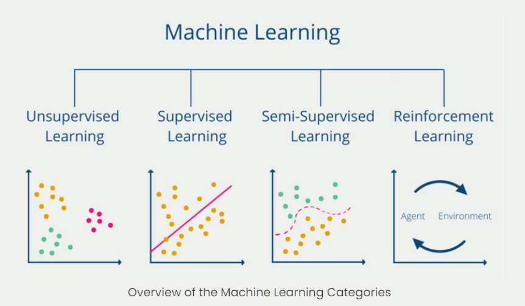

# PyTorchDeepLearning

Deep Learning with PyTorch.

## About `Deep Learning`

### Key Components

- The _data_ that we can learn from.
- A _model_ of how to transform the data.
- An _objective function_ that quantifies how well (or badly) the model is doing.
- An _algorithm_ to adjust the model's parameters to optimize the objective function.

### What deep learning is good for 🤖✔

- Problems with long lists of rules; for example, automotive driving, the traditional approach fails, machine learning/deep learning may help.
- Continually changing environments; deep learning can adapt to new scenarios.
- Discovering insighes with large collections of data; thinds with rules that can not be hand-crafted.

### What deep learning is _typically_ _**not**_ good for 👎

- When the explainability is in need; the patterns learnt by a deep learning model are typically uninterpretable by a human.
- When the traditional spproach is better; if you can accomplish what is needed with a simple rule-based system.
- When errors are unacceptable; the output of deep learning model are not always predictable.
- When the amount of data is limited; deep learning models _usually_ require a fairly large amount of data to produce great results.

## Anatomy of Neural Networks

- Input layer: data does in here
- Hidden layer(s): learns patterns in data
- Output layer: Outputs learnt representation or prediction probabilities

_Note_: pattern is an arbitrary term, it is interchangably used with "embedding", "weights", "feature representation", "feature vectors" and so on.

## Types of Learning

- Supervised learning
- Unsupervised & self-supervised learning
- Transfer learning

